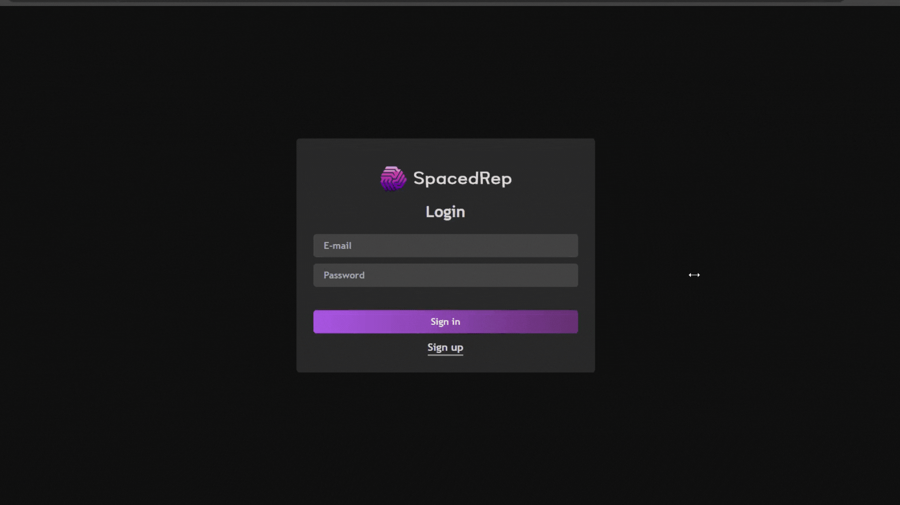

 

<h3 align="center">
 App utilizing React and Node.js/Express to facilitate spaced repetition learning with cards.
</h3>

## 🚀 Technologies

- [React](https://react.dev/) - A JavaScript library for building user interfaces.
- [TypeScript](https://www.typescriptlang.org/) - Typed superset of JavaScript that compiles to plain JavaScript.
- [Tailwind CSS](https://tailwindcss.com/) - A utility-first CSS framework for rapid UI development.

## 🛠 Keys Features

- <b>Dynamic Example Generation: </b> Automatically create and customize examples to aid in the efficient memorization of information.

- <b>Spaced Repetition Algorithm: </b> Leverage scientifically-proven spaced repetition algorithms to optimize learning and retention.

- <b>Flexible Card Creation: </b> Easily create, edit, and manage flashcards with support for text, images, and multimedia content.

- <b>Cloud Storage Integration: </b> Securely store and retrieve images and other resources using Amazon S3 integration.

 

  <h3 align='center'> Developed By Pedro Arruda </h3> 
  
 
    
    
    
  

<h3 align='center'>Feel free to reach out for any questions or collaboration opportunities!
 </h3>
